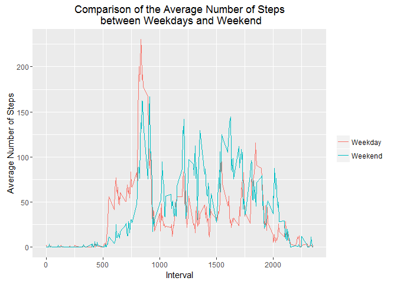

# Reproducible Research Homework_01
Caesar Hermogeno  
May 9, 2016  


## R Markdown

This is an R Markdown document. Markdown is a simple formatting syntax for authoring HTML, PDF, and MS Word documents. For more details on using R Markdown see <http://rmarkdown.rstudio.com>.

When you click the **Knit** button a document will be generated that includes both content as well as the output of any embedded R code chunks within the document. You can embed an R code chunk like this:

Loading and preprocessing the data
==================================

1. Load the data (i.e. read.csv())


```r
activityData <- read.csv('activity.csv')
dat = read.csv('activity.csv', header = T)
names(dat)
```

```
## [1] "steps"    "date"     "interval"
```

```r
str(dat)
```

```
## 'data.frame':	17568 obs. of  3 variables:
##  $ steps   : int  NA NA NA NA NA NA NA NA NA NA ...
##  $ date    : Factor w/ 61 levels "2012-10-01","2012-10-02",..: 1 1 1 1 1 1 1 1 1 1 ...
##  $ interval: int  0 5 10 15 20 25 30 35 40 45 ...
```

```r
head(dat)
```

```
##   steps       date interval
## 1    NA 2012-10-01        0
## 2    NA 2012-10-01        5
## 3    NA 2012-10-01       10
## 4    NA 2012-10-01       15
## 5    NA 2012-10-01       20
## 6    NA 2012-10-01       25
```
2. Histogram, Mean & Median

I will make a histogram of the total number of steps taken each day and I will summarize the data by day:


```r
totalSteps <- tapply(dat$steps, dat$date, sum, na.rm = T)
avgSteps <- tapply(dat$steps, dat$date, mean, na.rm = T)
par(mfrow = c(2, 1))
hist(totalSteps, breaks = 10, col = "red", main = "Distribution of the total Number of steps each day", 
    xlab = "Average Total Number of Steps")
hist(as.vector(avgSteps), breaks = 10, col = "blue", main = "Distribution of the Average Number of steps each day", 
    xlab = "Average Number of Steps")
```

<!-- -->

3. Average daily activity pattern

# Find the average number of steps grouped by intereval


```r
Steps = tapply(dat$steps, dat$interval, mean, na.rm = T)
```
# Convert levels of intervals into numeric

Interval <- as.numeric(l)

# Create the dataframe df of the Interval and Steps columns

df <- data.frame(Steps, Interval)


```r
library(ggplot2)
```

```
## Warning: package 'ggplot2' was built under R version 3.2.5
```

g <- ggplot(df, aes(Interval, Steps))
g + geom_line(colour = "blue") + ggtitle("Time Series Plot of the 5-minute Interval\n and the Average Number of Steps,\n Taken across all Days") + 
    ylab("Average Number of Steps")

Imputing missing values

# Missing data

```r
missing <- is.na(dat)
```
# Number of missing values


```r
(n.missing <- sum(missing))
```

```
## [1] 2304
```
## [1] 2304

# Impute data using the mice (multivariate imputation chains equation)
library(mice)

## Loading required package: Rcpp

## mice 2.21 2014-02-05

# Impute by replacing NA by the mean of steps


```r
dat$steps[is.na(dat$steps)] <- tapply(dat$steps, 
    dat$interval, mean, na.rm = TRUE)
```

# Number of total steps each day
# Summary statistics before and after imputing


```r
totStepsImp <- tapply(dat$steps, dat$date, sum)
summary(totalSteps)
```

```
##    Min. 1st Qu.  Median    Mean 3rd Qu.    Max. 
##       0    6778   10400    9354   12810   21190
```
from my findings, there is seem to be not a significant difference in the average number of total steps each day before and after imputing data.

# Compare total number of steps each day before and after imputing


```r
par(mfrow = c(2, 1))
hist(totalSteps, col = "red", xlab = "Average Total Number of Steps Before Imputing", 
    main = "", breaks = 10)
title("Distribution of the total Number of steps\n each day Before and After Imputing")
hist(totStepsImp, col = "cyan", main = "", xlab = "Average Total Number of Steps After Imputing", 
    breaks = 10)
```

<!-- -->

Are there differences in activity patterns between weekdays and weekends?

# Extract weekdays


```r
dat$Days <- weekdays(as.Date(as.character(dat$date)))
```
# Create a logical vector d where Days are Saturday or Sunday

```r
d <- dat$Days == "Saturday" | dat$Days == "Sunday"
```

# Call Saturday and Sunday Weekend

```r
dat$Days[d] = "Weekend"
```
# Call weekdays (Monday through Friday) Weekdays


```r
dat$Days[!d] = "Weekday"
```

# Weekdays

```r
datWD <- dat[dat$Days == "Weekday", ]
```

# Weekend

```r
datWE <- dat[dat$Days == "Weekend", ]
```
# Convert levels of interval into numeric for weekdays

```r
IntervalWD <- as.numeric(levels(as.factor(datWD$interval)))
```
# Convert levels of interval into numeric for the weekend

```r
IntervalWE <- as.numeric(levels(as.factor(datWE$interval)))
```

# Average number of steps during weekdays

```r
avgWD <- tapply(datWD$steps, datWD$interval, mean)
```
# Average number of steps during the weekend


```r
avgWE <- tapply(datWE$steps, datWE$interval, mean)
```

# Data frame combining average number of steps and interval during weekdays


```r
dfWD <- data.frame(avgWD, IntervalWD)
```
# Data frame combining average number of steps and interval during the
# weekend


```r
dfWE <- data.frame(avgWE, IntervalWE)
```
Convert Days into factor dat$Days <- as.factor(dat$Days)
dat$interval <- factor(dat$interval)


```r
plot(dfWD$IntervalWD, dfWD$avgWD, type = "l", main = "Comparison of the Average Number of Steps\n between Weekdays and the Weekend", 
    xlab = "Interval", ylab = "Number of Steps")
lines(dfWE$IntervalWE, dfWE$avgWE, col = "red")
legend("topright", c("Weekday", "Weekend"), col = c("black", "red"), lty = 1)
```

<!-- -->

# Add a column to the data frames that include weekdays and weekend days

```r
dfWD$wDays <- rep("Weekday", nrow(dfWD))
dfWE$wDays <- rep("Weekend", nrow(dfWD))
```

# Rename column names to match

```r
colnames(dfWD) <- c("Steps", "Interval", "wDays")
colnames(dfWE) <- c("Steps", "Interval", "wDays")
```

# rbind the dataframes


```r
df <- rbind(dfWD, dfWE)
```

# Convert wDays column into a factor

```r
df$wDays <- factor(df$wDays)
```

```r
library(lattice)
```

```
## Warning: package 'lattice' was built under R version 3.2.5
```

# Use lattice library to plot

```r
xyplot(Steps ~ Interval | wDays, data = df, type = "l", layout = c(1, 2), ylab = "Average Number of Steps")
```

<!-- -->


```r
library(ggplot2)
```

# Using ggplot2 package

```r
g <- ggplot(df, aes(Interval, Steps, fill = wDays, colour = wDays))
g + geom_line() + labs(colour = "") + ggtitle("Comparison of the Average Number of Steps\n between Weekdays and Weekend") + 
    ylab("Average Number of Steps")
```

<!-- -->
